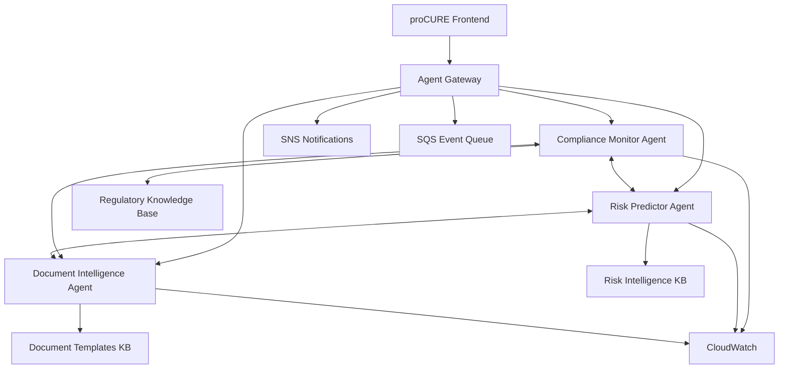

# Multi-Agent Orchestration Guide

## Overview

This guide details the orchestration patterns and best practices for deploying and managing the proCURE platform's three specialized AWS Bedrock agents as an integrated multi-agent system.

## Agent Ecosystem Architecture



## Orchestration Patterns

### 1. Sequential Orchestration
Used for linear workflows where each agent's output feeds into the next agent's input.

```yaml
sequential_workflows:
  supplier_onboarding:
    description: "Complete supplier validation and risk assessment"
    sequence:
      1. document_intelligence: "validate_supplier_documents"
      2. compliance_monitor: "assess_regulatory_compliance"
      3. risk_predictor: "comprehensive_risk_assessment"
    data_flow:
      - document_validation_results → compliance_assessment_input
      - compliance_scores → risk_assessment_input
    timeout: "180_seconds"
    retry_policy: "exponential_backoff"
    
  audit_preparation:
    description: "Comprehensive audit readiness assessment"
    sequence:
      1. document_intelligence: "audit_document_validation"
      2. compliance_monitor: "audit_compliance_review"
      3. risk_predictor: "audit_risk_assessment"
    consolidation: "unified_audit_report"
    approval_required: true
```

### 2. Parallel Orchestration
Used when multiple agents can work simultaneously on different aspects of the same problem.

```yaml
parallel_workflows:
  emergency_supplier_assessment:
    description: "Rapid multi-dimensional supplier evaluation"
    parallel_execution:
      - compliance_monitor: "urgent_compliance_check"
      - risk_predictor: "emergency_risk_assessment"
      - document_intelligence: "critical_document_validation"
    aggregation_strategy: "weighted_scoring"
    completion_policy: "wait_for_all"
    timeout: "60_seconds"
    
  quarterly_supplier_review:
    description: "Comprehensive quarterly assessment"
    parallel_execution:
      - compliance_monitor: "quarterly_compliance_audit"
      - risk_predictor: "quarterly_risk_update"
      - document_intelligence: "document_lifecycle_review"
    consolidation: "quarterly_supplier_scorecard"
    scheduling: "automated_quarterly"
```

### 3. Event-Driven Orchestration
Reactive orchestration based on specific events or triggers.

```yaml
event_driven_workflows:
  compliance_violation_response:
    trigger: "compliance_violation_detected"
    immediate_actions:
      - compliance_monitor: "violation_assessment"
      - risk_predictor: "impact_analysis"
    conditional_actions:
      - if: "violation_severity == 'critical'"
        then:
          - document_intelligence: "emergency_document_review"
          - risk_predictor: "supplier_suspension_risk"
    notifications:
      - teams: ["compliance", "risk", "procurement"]
      - escalation: "automatic_if_critical"
      
  document_anomaly_response:
    trigger: "document_anomaly_detected"
    response_sequence:
      1. document_intelligence: "detailed_anomaly_analysis"
      2. compliance_monitor: "compliance_impact_assessment"
      3. risk_predictor: "fraud_risk_evaluation"
    decision_matrix:
      - high_fraud_risk: "immediate_supplier_suspension"
      - medium_risk: "enhanced_monitoring"
      - low_risk: "standard_follow_up"
```

### 4. Collaborative Decision Making
Agents work together to reach consensus on complex decisions.

```yaml
collaborative_workflows:
  supplier_approval_decision:
    description: "Multi-agent supplier approval consensus"
    participants:
      - compliance_monitor: "regulatory_approval_recommendation"
      - risk_predictor: "risk_based_approval_recommendation"
      - document_intelligence: "document_completeness_assessment"
    decision_algorithm: "weighted_voting"
    weights:
      compliance_score: 0.4
      risk_score: 0.35
      document_quality: 0.25
    approval_threshold: 0.75
    escalation_conditions:
      - conflicting_recommendations: "human_review"
      - borderline_scores: "additional_analysis"
      
  contract_risk_assessment:
    description: "Collaborative contract risk evaluation"
    workflow:
      1. document_intelligence: "contract_content_analysis"
      2. compliance_monitor: "regulatory_compliance_review"
      3. risk_predictor: "contract_risk_modeling"
      4. consensus_building: "unified_risk_assessment"
    conflict_resolution: "escalation_to_risk_committee"
```

## Agent Communication Protocols

### Inter-Agent Messaging
```yaml
messaging_patterns:
  synchronous_communication:
    protocol: "HTTPS"
    format: "JSON"
    timeout: "30_seconds"
    retry_policy: "3_attempts"
    
  asynchronous_messaging:
    message_broker: "Amazon_SQS"
    message_format: "CloudEvents"
    delivery_guarantee: "at_least_once"
    dead_letter_queue: "enabled"
    
  event_streaming:
    platform: "Amazon_Kinesis"
    partition_key: "supplier_id"
    retention: "24_hours"
    replay_capability: "enabled"
```

### Data Sharing Protocols
```yaml
data_sharing:
  compliance_to_risk:
    shared_data:
      - compliance_scores
      - violation_history
      - regulatory_changes_impact
    sharing_frequency: "real_time"
    data_format: "structured_json"
    
  risk_to_document:
    shared_data:
      - risk_indicators
      - fraud_patterns
      - investigation_triggers
    sharing_frequency: "event_driven"
    encryption: "required"
    
  document_to_compliance:
    shared_data:
      - document_validation_results
      - certificate_status
      - expiration_alerts
    sharing_frequency: "immediate"
    validation: "integrity_checks"
```

## Deployment Architecture

### AWS Infrastructure
```yaml
infrastructure:
  bedrock_agents:
    compliance_monitor:
      model: "claude-3-sonnet"
      alias: "PROD"
      concurrent_executions: 50
      memory: "2GB"
      
    risk_predictor:
      model: "claude-3-sonnet"
      alias: "PROD"
      concurrent_executions: 30
      memory: "4GB"
      
    document_intelligence:
      model: "claude-3-sonnet"
      alias: "PROD"
      concurrent_executions: 100
      memory: "3GB"
      
  orchestration_layer:
    step_functions:
      - supplier_onboarding_workflow
      - audit_preparation_workflow
      - emergency_response_workflow
    
    api_gateway:
      endpoints:
        - "/agents/compliance"
        - "/agents/risk"
        - "/agents/documents"
        - "/orchestration/workflows"
    
    lambda_functions:
      - workflow_coordinator
      - event_processor
      - notification_handler
      - data_aggregator
```

### Service Dependencies
```yaml
dependencies:
  knowledge_bases:
    regulatory_kb:
      s3_bucket: "procurement-regulatory-kb"
      update_frequency: "daily"
      
    risk_intelligence_kb:
      s3_bucket: "procurement-risk-kb"
      update_frequency: "hourly"
      
    document_templates_kb:
      s3_bucket: "procurement-docs-kb"
      update_frequency: "weekly"
      
  data_stores:
    dynamodb_tables:
      - supplier_profiles
      - compliance_history
      - risk_assessments
      - document_metadata
      
    s3_buckets:
      - supplier-documents
      - compliance-reports
      - risk-models
      - audit-trails
      
  monitoring:
    cloudwatch:
      - custom_metrics
      - log_aggregation
      - alerting_rules
      
    x_ray:
      - distributed_tracing
      - performance_analysis
```

## Monitoring and Observability

### Multi-Agent Dashboards
```yaml
monitoring_dashboards:
  operational_overview:
    panels:
      - "Agent Health Status"
      - "Workflow Execution Status"
      - "Inter-Agent Communication Latency"
      - "Overall System Throughput"
      
  business_intelligence:
    panels:
      - "Supplier Risk Distribution"
      - "Compliance Trend Analysis"
      - "Document Processing Efficiency"
      - "Decision Accuracy Metrics"
      
  technical_performance:
    panels:
      - "Agent Response Times"
      - "Error Rates by Agent"
      - "Resource Utilization"
      - "Queue Depth Monitoring"
```

### Alerting Configuration
```yaml
alert_rules:
  agent_health:
    - name: "Agent Unavailable"
      condition: "agent_health_status == 'unhealthy'"
      severity: "critical"
      actions: ["immediate_notification", "auto_failover"]
      
    - name: "High Error Rate"
      condition: "error_rate > 5%"
      severity: "warning"
      actions: ["team_notification", "investigation_trigger"]
      
  workflow_performance:
    - name: "Workflow Timeout"
      condition: "workflow_duration > threshold"
      severity: "major"
      actions: ["workflow_termination", "escalation"]
      
    - name: "High Queue Depth"
      condition: "queue_depth > 100"
      severity: "warning"
      actions: ["auto_scaling", "capacity_alert"]
      
  business_impact:
    - name: "Decision Accuracy Drop"
      condition: "accuracy_rate < 90%"
      severity: "major"
      actions: ["quality_review", "model_retraining"]
      
    - name: "SLA Breach"
      condition: "response_time > sla_threshold"
      severity: "critical"
      actions: ["immediate_escalation", "capacity_increase"]
```

## Security and Governance

### Multi-Agent Security Framework
```yaml
security_framework:
  authentication:
    agent_to_agent: "mutual_tls"
    client_to_system: "oauth2_with_iam"
    api_gateway: "api_keys_with_rate_limiting"
    
  authorization:
    rbac_model: "fine_grained"
    policy_enforcement: "centralized"
    audit_logging: "comprehensive"
    
  data_protection:
    encryption_in_transit: "TLS_1.3"
    encryption_at_rest: "AES_256_GCM"
    key_management: "AWS_KMS"
    
  network_security:
    vpc_isolation: "enabled"
    security_groups: "restrictive"
    nacls: "layered_defense"
    
  compliance:
    gdpr_compliance: "enforced"
    hipaa_ready: "configured"
    sox_controls: "implemented"
```

### Governance Controls
```yaml
governance:
  change_management:
    agent_updates: "controlled_deployment"
    workflow_changes: "approval_required"
    configuration_changes: "audited"
    
  quality_assurance:
    testing_requirements:
      - unit_tests: "mandatory"
      - integration_tests: "required"
      - end_to_end_tests: "comprehensive"
      - performance_tests: "load_and_stress"
    
  audit_requirements:
    decision_audit_trail: "immutable"
    agent_interaction_logging: "detailed"
    workflow_execution_tracking: "complete"
    
  risk_management:
    agent_failure_handling: "graceful_degradation"
    data_backup_strategy: "automated"
    disaster_recovery: "cross_region"
```

## Cost Optimization

### Multi-Agent Cost Management
```yaml
cost_optimization:
  resource_optimization:
    agent_scaling: "demand_based"
    model_selection: "workload_appropriate"
    caching_strategy: "aggressive"
    
  usage_patterns:
    peak_hours: "06:00-18:00_UTC"
    off_peak_scaling: "reduced_capacity"
    weekend_operations: "minimal"
    
  cost_controls:
    budget_alerts:
      - threshold_50_percent: "team_notification"
      - threshold_80_percent: "management_alert"
      - threshold_95_percent: "auto_throttling"
    
    cost_allocation:
      by_agent: "tracked"
      by_workflow: "monitored"
      by_customer: "allocated"
```

### Performance vs Cost Optimization
```yaml
optimization_strategies:
  agent_model_selection:
    simple_tasks: "claude-3-haiku"
    standard_tasks: "claude-3-sonnet"
    complex_analysis: "claude-3-opus"
    
  caching_optimization:
    compliance_scores: "15_minutes"
    risk_assessments: "30_minutes"
    document_validations: "1_hour"
    
  batch_processing:
    document_analysis: "preferred"
    risk_calculations: "scheduled"
    compliance_updates: "overnight"
```

## Development and Testing

### Multi-Agent Testing Strategy
```yaml
testing_framework:
  unit_testing:
    individual_agents: "isolated_testing"
    function_validation: "comprehensive"
    mock_dependencies: "realistic"
    
  integration_testing:
    agent_to_agent: "communication_validation"
    workflow_execution: "end_to_end"
    error_handling: "failure_scenarios"
    
  performance_testing:
    load_testing: "realistic_volumes"
    stress_testing: "peak_capacity"
    endurance_testing: "24_hour_runs"
    
  chaos_engineering:
    agent_failure_simulation: "random"
    network_partition_testing: "systematic"
    resource_exhaustion: "controlled"
```

### Development Best Practices
```yaml
development_practices:
  code_organization:
    agent_separation: "clear_boundaries"
    shared_libraries: "common_utilities"
    configuration_management: "centralized"
    
  deployment_practices:
    blue_green_deployment: "zero_downtime"
    canary_releases: "gradual_rollout"
    rollback_procedures: "automated"
    
  monitoring_integration:
    instrumentation: "comprehensive"
    tracing: "distributed"
    logging: "structured"
```

## Troubleshooting Guide

### Common Issues and Solutions
```yaml
troubleshooting:
  agent_connectivity_issues:
    symptoms: ["timeout_errors", "connection_refused"]
    diagnosis: ["network_connectivity", "iam_permissions"]
    solutions: ["security_group_update", "policy_adjustment"]
    
  workflow_execution_failures:
    symptoms: ["workflow_timeout", "partial_completion"]
    diagnosis: ["agent_performance", "resource_constraints"]
    solutions: ["capacity_increase", "timeout_adjustment"]
    
  data_consistency_issues:
    symptoms: ["conflicting_results", "stale_data"]
    diagnosis: ["cache_invalidation", "synchronization"]
    solutions: ["cache_refresh", "event_replay"]
    
  performance_degradation:
    symptoms: ["high_latency", "low_throughput"]
    diagnosis: ["resource_utilization", "bottleneck_analysis"]
    solutions: ["scaling_up", "optimization_tuning"]
```

### Emergency Response Procedures
```yaml
emergency_procedures:
  agent_failure:
    immediate_actions:
      - "switch_to_backup_agent"
      - "notify_operations_team"
      - "log_incident_details"
    investigation_steps:
      - "analyze_cloudwatch_logs"
      - "check_bedrock_service_health"
      - "validate_iam_permissions"
    recovery_actions:
      - "restart_agent_service"
      - "validate_functionality"
      - "resume_normal_operations"
      
  system_wide_outage:
    escalation_tree: "defined"
    communication_plan: "stakeholder_notification"
    business_continuity: "manual_fallback_procedures"
```

---

**Guide Version**: 1.0  
**Last Updated**: January 2024  
**Architecture**: AWS Well-Architected  
**Support**: architecture-team@procure-platform.com